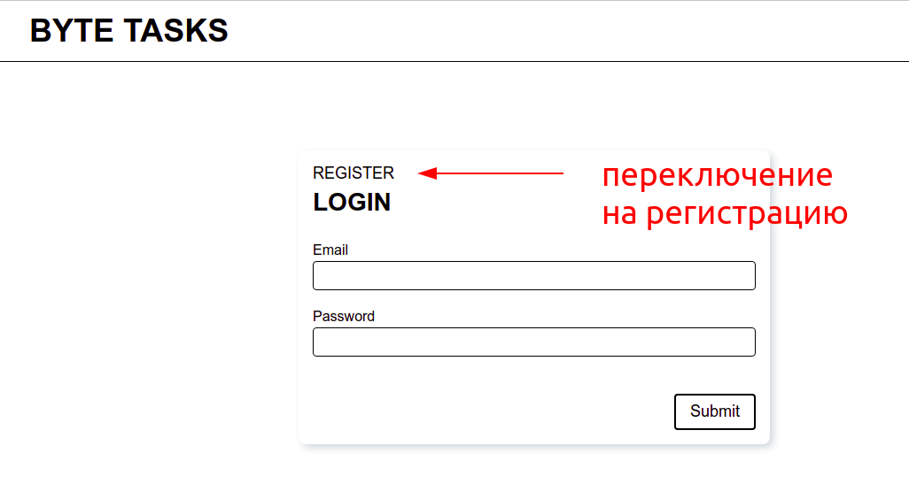
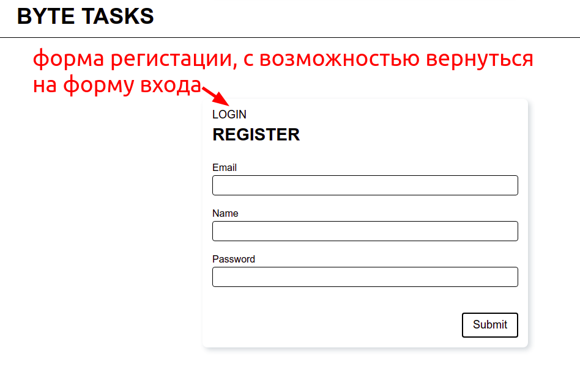
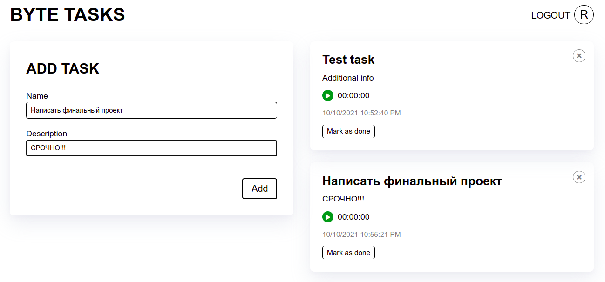
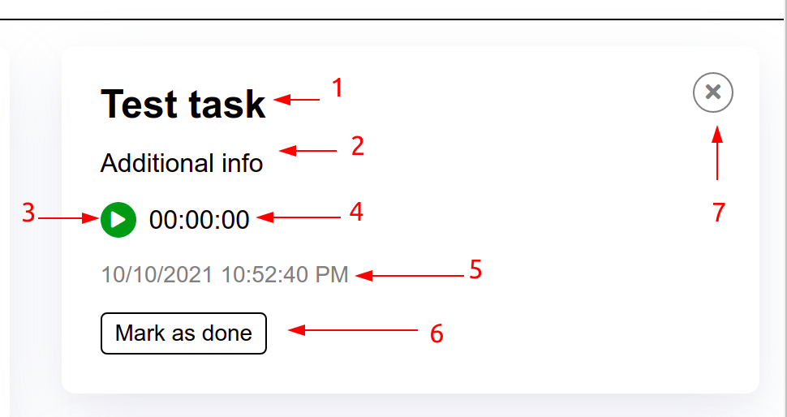
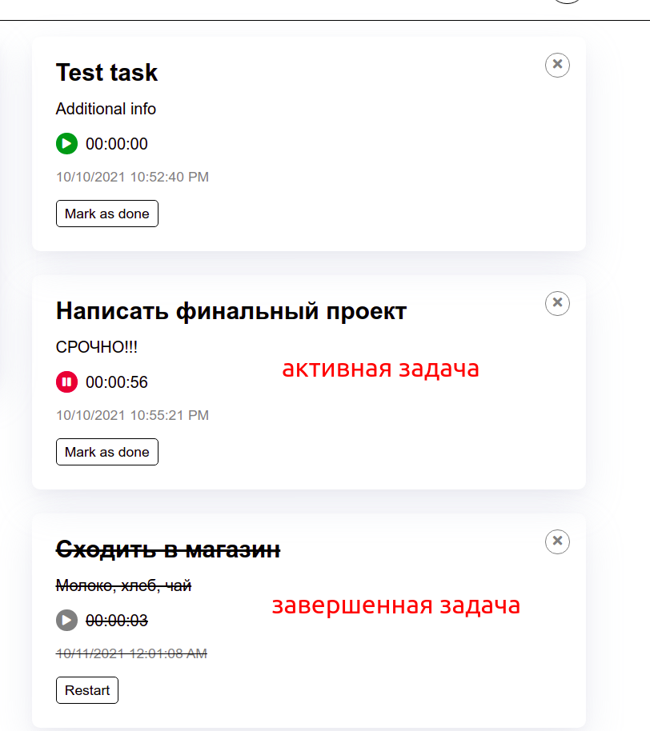

### Final Project
Реализовать приложение **TODO-list** (список задач), c возможностью треккинга потраченого времени на каждую задачу. Так же, в приложении необходимо реализовать **авторизацию** существующих и **регистрацию** новых пользователей. 

Пример готового проекта доступен по ссылке: 
https://byte-tasks-frontend.herokuapp.com/

API для реализации всего необходимого функционала представлено по адресу `https://byte-tasks.herokuapp.com/api`.
Документация с перечислением всех доступных эндпоинтов находится [тут](https://byte-tasks.herokuapp.com/api-docs/).
По ссылке вы сможете ознакомится со всей необходимой информацией, касаемо работы с API.

В API присутсвуют как открытые эндпоинты (например, для регистрации и авторизации), так и требующие авторизации. 

Для того, что бы получить доступ к "закрытым" эндпоинтам, необходимо передать в запросе следующий заголовок (header), 
где вместо `YOUR_TOKEN` нужно указать токен авторизации, который вы получите после успешного запроса на эндпоинт `/api/auth/login`.

```
Authotization: Bearer YOUR_TOKEN
```

Так же, для работы с API, к КАЖДОМУ запросу должен быть прикреплен заголовок. Без него тело запросов не сможет быть обработанно. 

```
Content-Type: application/json;
```

При попытке отправить запрос на закрытый эндпоинт без вышеуказанного заголовка, вы получите ошибку `401 Unathorized.`

**Авторизация / регистрация:**
1. При входе на сайт, неавторизованному пользователю пользователю должна быть показана форма для входа (логина) и возможность переключиться на форму регистрации. 
Логин:

Регистрация:


Форма логина должна содержать поля для ввода: 
- почты (email)
- пароля (password)

POST запрос отправляется на `/api/auth/login`

Форма регистрации: 
- почты (email)
- имени
- пароля (password)

POST запрос отправляется на `/api/auth/register`


2. После заполнения формы логина правильными данными и успешной отправки запроса, пользователю показывается основной UI приложения.

3. При обновлении страницы сессия должна сохраняться. То есть, если пользователь уже проходил авторизацию в приложении, то ему должен быть сразу показан основной UI. 

**Основная часть:**

На странице присутсвуют такие элементы: 
 - **Хедер**, где отображено имя текущего авторизованного пользователя и кнопка *Logout*
 - Форма для добавления карточки с задачей (детально о ней дальше)
 - Список задач текущего пользователя (детально о нем позже)

 Основной экран приложения: 


**Хедер:**
1. Кнопка Logout. При нажатии на нее завершается текущая сессия, пользователю показыватся форма входа. При обновлении страницы (после нажатия на Logout) так же показывается стартовый экран. 

2. Имя пользователя (или первая буква его имени). Для получения этого значения, сразу после успешного логина, отправить GET запрос на `/api/auth/user/self`

**Форма для добавления задачи:**
1. Содержит 2 поля: 
    - название задачи (name) - обязательное
    - описание задачи (description) - необязательное

2. После сабмита формы и успешной отправки запроса, в списке задач должна появится созданная задача. 

3. Данные, полученные с формы следует отправлять POST запросом по эндпоинту `/api/task`.

**Список задач:**
1. Для получения всех задач необходимо отправить GET запрос по адресу `/api/task`
2. По этому эндпоинту будут возвращены только задачу ТЕКУЩЕГО авторизованного пользователя. Определение текущего пользователя происходит на основе переданного заголовка Authorization, который содержит токен авторизации. 

**Карточка задачи:**
1. Карточка задачи - элемент, который визуально представляет задачу пользователю. 
Содердит следующие элементы: 
    1. Заголовок (название) задачи - name
    2. Описание задачи - description
    3. Кнопка Play / Pause - запускает и оставливает трекинг времени для задачи. 
    4. Время затраченное на задачу (таймер) - timeTracked
    5. Дата создания задачи - createdAt
    6. Кнопка для завершения или перезапуска задачи.
    7. Кнопка для удалиния задачи.



2. **Треккинг времени** для задачи: 
Время затраченное на задачу отображено в карточке задачи. Таймер включается при нажатии на кнопку Play, при следующем нажатии ставится на паузу. При включенном таймере кнопка Play заменятеся на кнопку Pause. При повторном нажатии на Play, подсчет времени должен продолжиться с того же значения. 
 - **Запуск таймера** 
 Таймер запускается при нажатии на кнопку Play. На фронтенд стороне должен просто запустится отсчет времени. Паралельно с этим, необхоимо отправить PATCH запрос на `/api/task` с body
```js
{
  isActive: true
}
```
 Трекинг времени на бекенд стороне происходит автоматически, что означает, что при последующем запросе карточек, вы получите актуальное значение timeTracked. 
 - **Остановка таймера** 
 Выполнятся по аналогии с запуском, отличается только телом запроса 
```js
  {
    isActive: false
  }
```
 - **Завершение и перезапуск задачи:**
 Выполняется путем нажатия на кнопку Mark as finished. Для отметки задачи как завершенной необходимо отправить PATCH запрос на `/api/task` с body 
```js
{
  isActive: false,
  isFinished: true
}
```
 Повторное нажатие на кнопку должно привести к перезапуску задачи. При этом значение затраченного времени может быть как сброшено, так и оставлено прежним, на ваше усмотрение. PATCH запрос на `/api/task` с body 
```js
{
  isFinished: false,
  timeTracked: 0, // для сброса таймера
}
```
 - **Удаление и перезапуск задачи:**
При нажатии на кнопку удаления - задача удаляется с доски. Для удаления задачи из базы данных, необходимо отправить DELETE запрос на `/api/task`



Технические требования. 
1. Проект должен быть собран с помощью инстумента **webpack**.
2. Весь код должен быть организован в стиле ООП. Обязательно должны присутсвовать сдедующие классы: 
   - API.
   Cодержит в себе логику работы с сервером, обработку запросов и ошибок. Под каждый эндпоинт можно написать отдельный метод.
   - Form.
   Класс для работы с формами. 
   - Input.
   Класс, с помощью которого будут создаваться текстовые поля ввода.
   - Task.
   Класс, который содержит всю логику работы с карточкой задачи, включая отрисовку и работу с АПИ.

   Реализацию классов FORM и Input можно взять с классной работы. Их придется немного доработать. 
3. Каждый класс должен находится в отдельном файле. 
4. Четких требований к визульному оформелению нет, но не пожалейте времени, что бы сделать красиво. 

Внимательно прочитайте все пункты, уточните у ментора, если что-то непонятно. Так же, поклацайте готовый проект, изучите как отправляются запросы, какие данные отправляются. 


